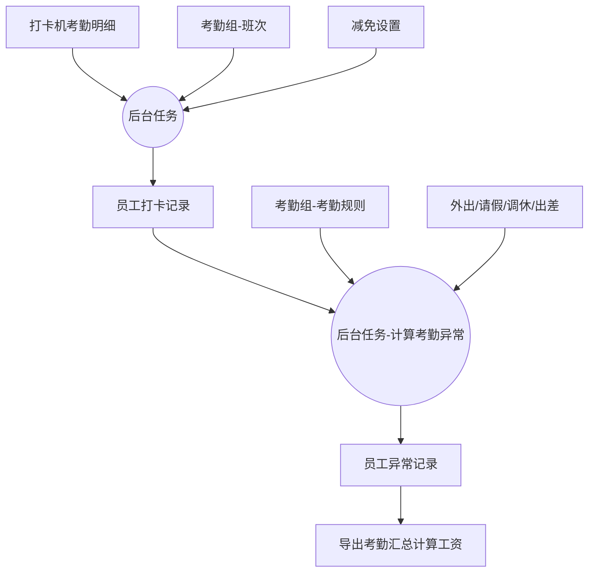
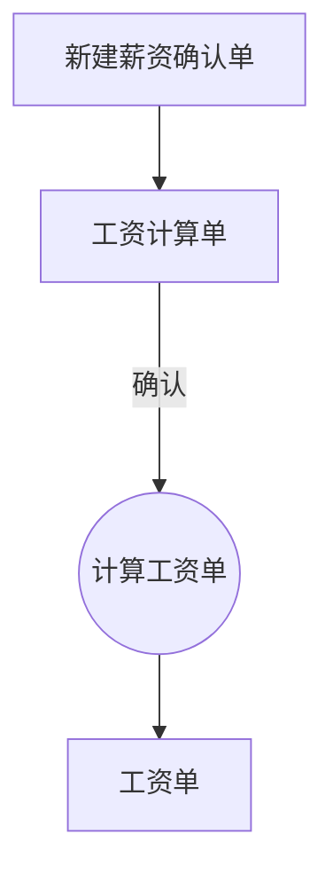
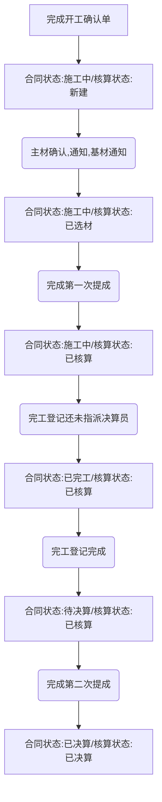
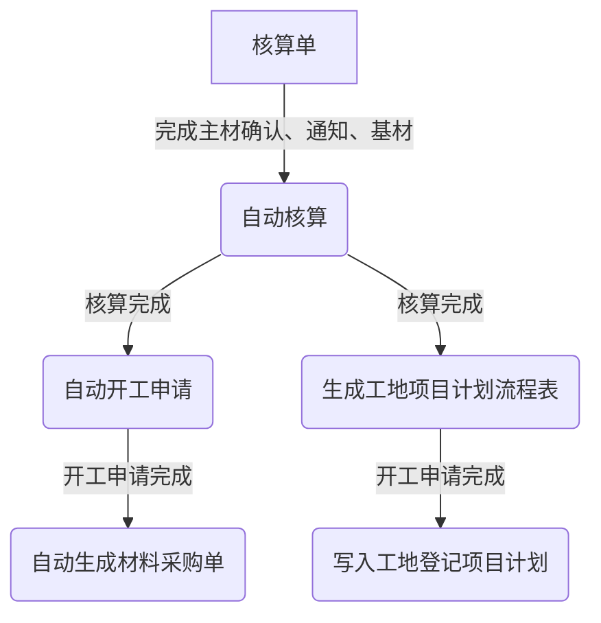
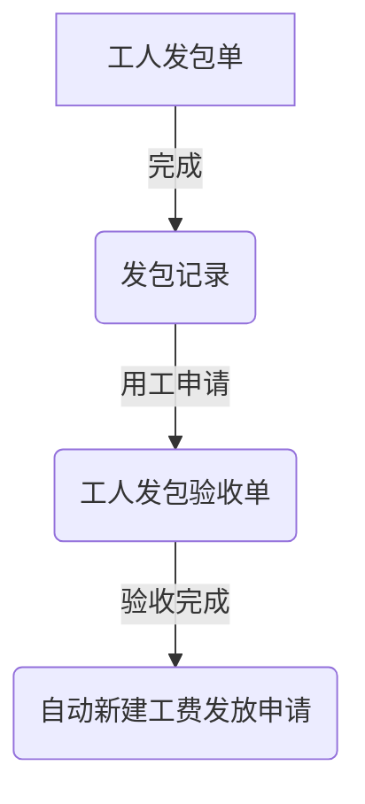
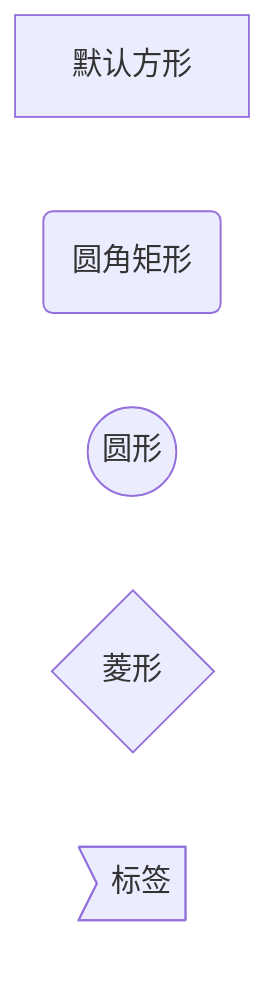
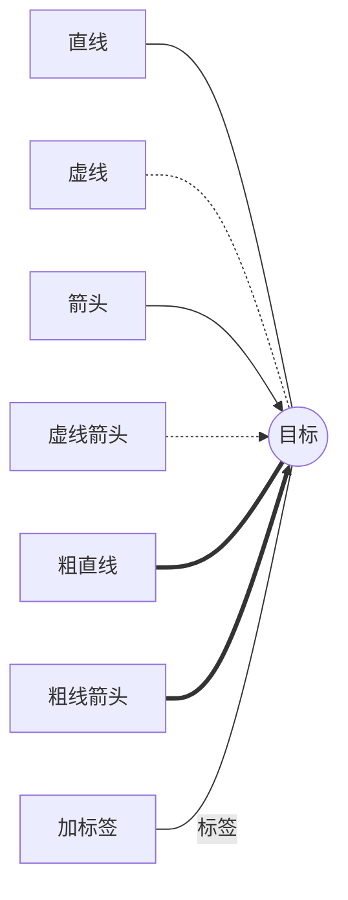
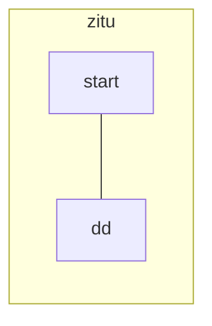

# IMS部分功能逻辑
---
## 什么时候更新考核提成点
1. 项目提成单流程通过
2. 合同跨阶段收款
3. 决算单
4. 后台任务：计算上月提成记录
## 设置考核提成时间点逻辑
1. 时间要先满足在本月或上月（这里的时间是合同有效日期、实际开工日期。。。等）
2. 再匹配考核时间点设置条件
3. 再根据条件匹配值里面的内容
---
## 核算提成点设置
- 所得提成点比例：根据所选单据中设置的提成乘以现在设置的这个比例为最终提成比例
- 设置目标提成点：不管所选单据中设置的提成比例是多少，最终都按照这里设置的提成比例计算
- 设置增减提成点：不管之前单据中设置提成比例是多少，都按照这个设置进行相应增减
## 什么时候更新核算提成点？
1. 项目提成单流程通过后
2. 回访任务
3. 跨阶段合同收款（项目提成单流程要通过）
4. 决算单流程通过
5. 后台任务：计算上月提成记录

***核算业绩：通过设置的核算业绩得到提成基数***
## 合同决算流程
- 完工登记
- 合同收款完成
- 核算单里完成提成单流程
## 服务器缓存清理

---
## 基装
- 基装项目设置为最基本基装项目设置
- 基装报价项目将基装项目与基装材料、工种、工程项目对应起来
- 工人发包单、核算单添加基装明细中添加基装项目数据来源为基装报价项目中已启用为本公司的数据
- 基装材料通知单中选择的材料来源为材料产品设置中被启用的被公司的基装材料

## 材料价格变更
- 核算价：变更后可以在核算单新建主材时立即生效
- 报价：在合同签单前变更可以在此合同选择主材时生效，在合同签单后变更则不生效（主材确认单中查看）
- 成本价：变更后可以在材料采购单中选择主材时立即生效

## 工人发包单
### 添加基装项目
来源于*基装报价项目*，*基装报价项目*又根据**基装项目**进行设置，**基装项目**再关联***基装工种类型设置***
## 考勤相关


## 生成工资单


## 核算单流程个状态转变
开工确认完成


## 开工完成自动生成工人发包单逻辑
1. 先在***基装工种类型设置***中设置工种类型（水电安装、水电改造）
2. 使用第一步的工种类型在***基装项目报价***中设置对应报价
3. 前两步的设置最好都是唯一
4. 没有手动新建第一步设置的工种类型的发包单
5. 完成开工申请

## 自动生成材料采购单


## 工费发放申请（之一）

列1|列2|列3|列4|列5
:-|-|-|-|-
行1|单元格1|单元格4|单元格5|单元格7
行2|单元格2|单元格3|单元格6|单元格8

---
`print("asd")`
```
def asd():
	hhh = "juy"
	for i in hhh:
		print(i)
```

---






这是一个页面连接[asd](www.baidu.com)
网页连接<https://www.baidu.com>
<font color=green size=8 face=雅黑 >字体颜色大小</font>